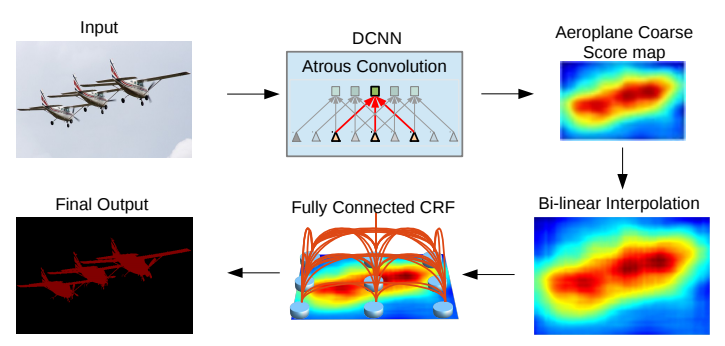

# DeepLab v2 Implementation with Pytorch


## 0. Develop Environment
```
Docker Image
- tensorflow/tensorflow:tensorflow:2.4.0-gpu-jupyter

Library
- Pytorch : Stable (1.7.1) - Linux - Python - CUDA (11.0)
```
- Using Single GPU (not tested on cpu only)


## 1. Explain about Implementation


## 2. Brief Summary of *'DeepLab: Semantic Image Segmentation with Deep Convolutional Nets, Atrous Convolution, and Fully Connected CRFs'*

### 2.1. Goal
- Improve performance of semantic segmentation

### 2.2. Intuition
- Atrous algorithm : prevent severe signal downsampling
- MSC & ASPP : cover the existence of objects at multiple scales
- Fully connected pairwise CRF : improve localization accuracy

### 2.3. Evaluation Metric
- Mean intersection over union

### 2.4. Network Architecture


- DCNN : modified ResNet101
  * skip subsampling in 2 max-pooling layers
  * atrous algorithm with rate 2, 4 in subsequent layers
  * ASPP at last
  * for more details, see ./Implementation/model.py
- Fully connected pairwise CRF : followed the paper of [Efficient Inference in Fully Connected CRFs with Gaussian Edge Potentials](https://arxiv.org/pdf/1210.5644.pdf)

### 2.5. Train and Inference on PASCAL VOC 2012
#### 2.5.1. Train
- 2-stage training
  * learn DCNN first
  * learn CRF next
- Pre-trained : MS-COCO
- Objective : sum of cross-entropy terms for each spatial position in the CNN output map
- Train Details
  * minibatch SGD with momentum
    * batch size : 10
    * learning rate : 0.001
    * momentum : 0.9
    * weight decay : 0.0005

#### 2.5.2. Inference
- MSC : multi-scale inputs with max fusion
- Upsampling : bilinear upsampling CNN output to get input shape (h, w)

## 3. Reference Paper
- DeepLab: Semantic Image Segmentation with Deep Convolutional Nets, Atrous Convolution, and Fully Connected CRFs [[paper]](https://arxiv.org/pdf/1606.00915.pdf)
- Original DeepLab v2 Implementation with Caffe [[bitbucket]](https://bitbucket.org/aquariusjay/deeplab-public-ver2/src/master/)
